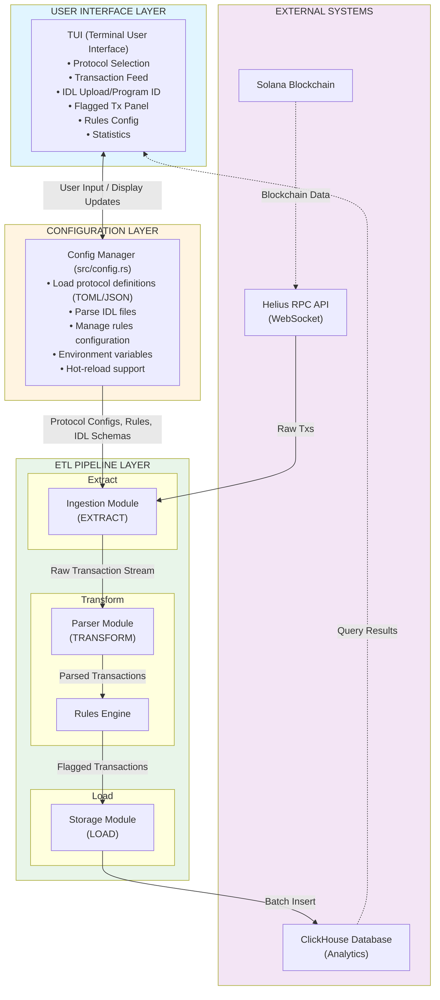
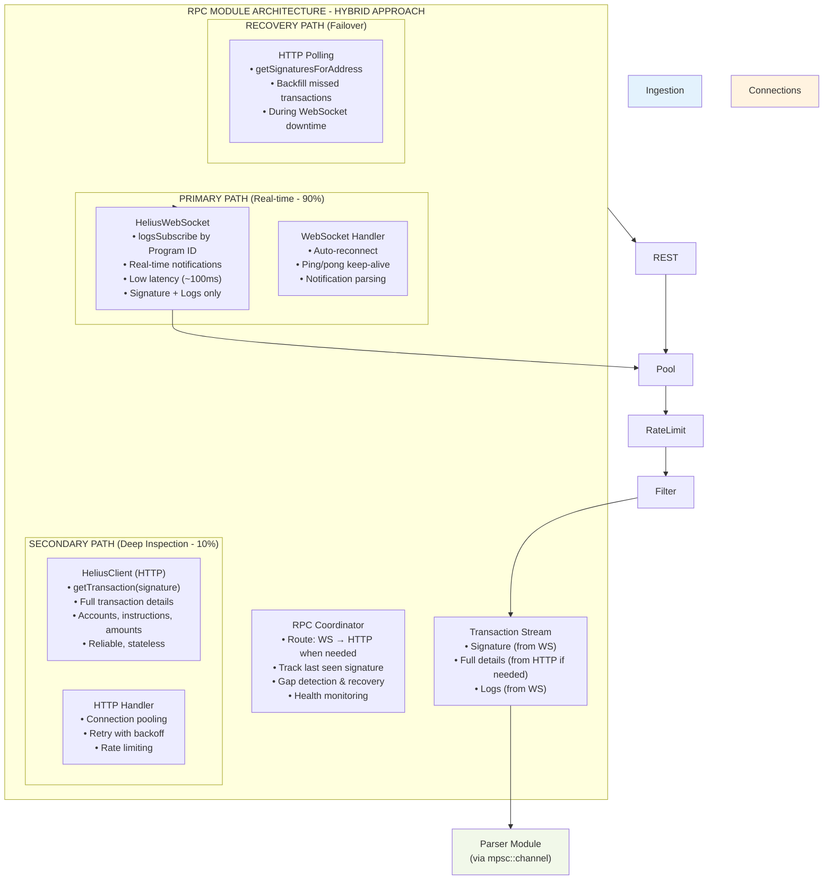
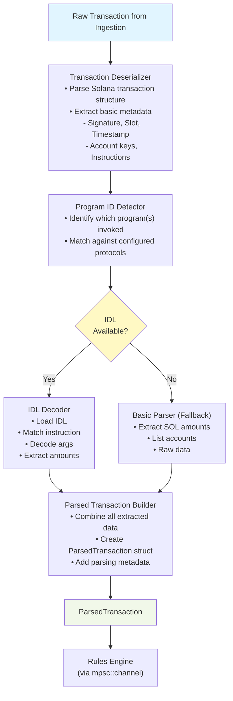
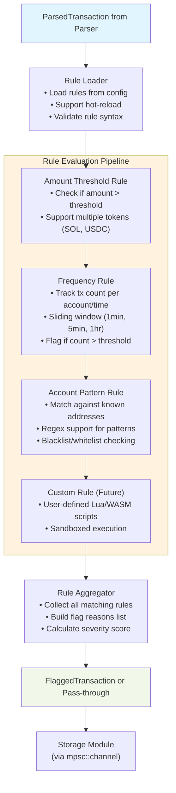
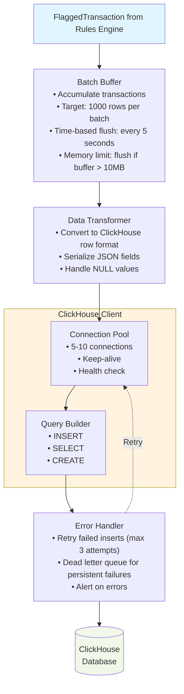
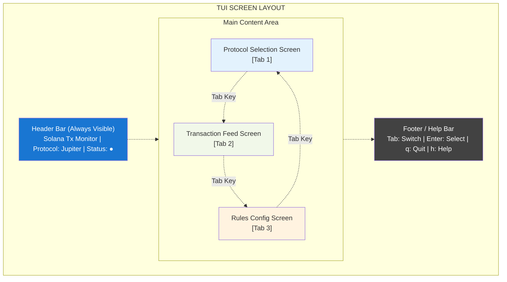
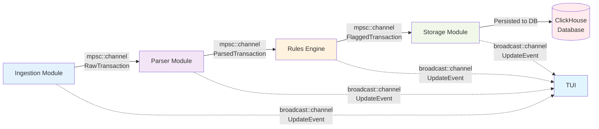
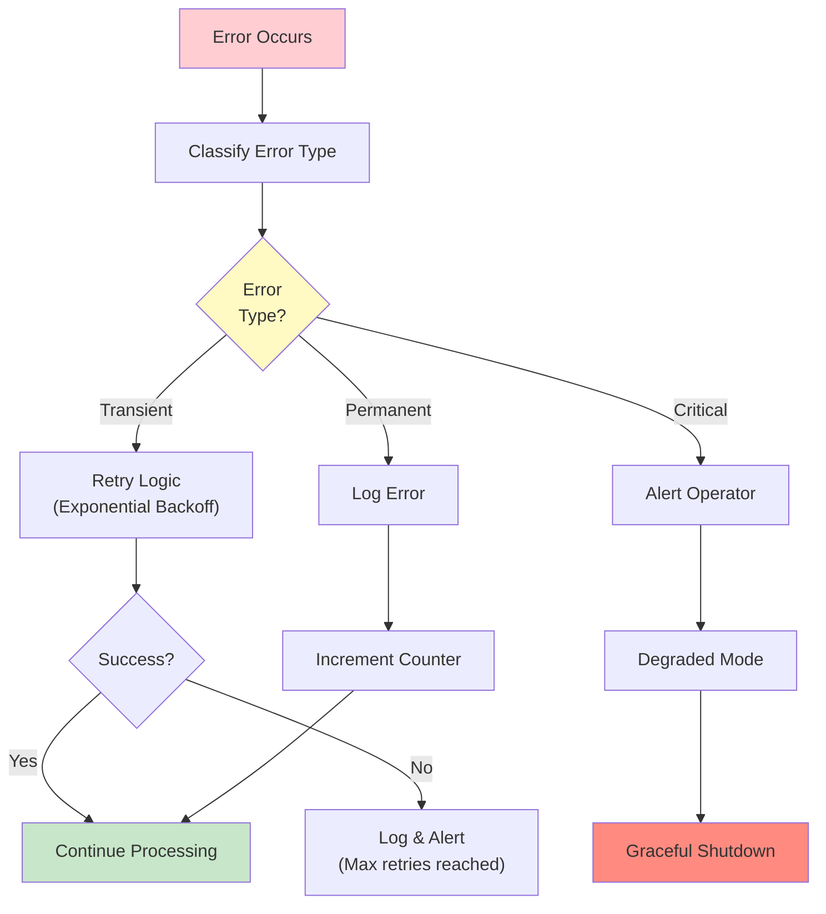
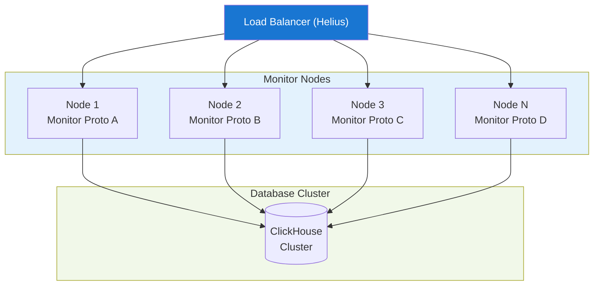

# Solana Transaction Monitor Tool - Architecture

## Table of Contents
1. [System Overview](#system-overview)
2. [High-Level Architecture](#high-level-architecture)
3. [Component Details](#component-details)
4. [Data Flow](#data-flow)
5. [Module Responsibilities](#module-responsibilities)
6. [Database Schema](#database-schema)
7. [Error Handling Strategy](#error-handling-strategy)
8. [Scalability Considerations](#scalability-considerations)

---

## System Overview

The Solana Transaction Monitor Tool is an **ETL (Extract, Transform, Load) pipeline** that monitors Solana blockchain transactions for specific protocols, applies configurable flagging rules, and stores results in ClickHouse for analytics.

**Key Capabilities:**
- Real-time transaction monitoring via Helius RPC
- Protocol-specific filtering (Program ID based)
- IDL-powered instruction decoding
- Configurable flagging rules
- Interactive TUI for management
- High-performance analytics with ClickHouse

---

## High-Level Architecture



---

## Component Details

### 1. **RPC Module** (`src/rpc/mod.rs`)

**Purpose:** Extract transactions from Solana blockchain via Helius RPC (Hybrid HTTP + WebSocket)

**Architecture Decision: Hybrid Approach (Best of Both Worlds)**



**Key Features:**
- Dual connection mode: WebSocket (primary) + REST (fallback)
- Connection pooling for high throughput
- Exponential backoff retry logic
- Rate limiting to respect Helius API limits
- Filter transactions by Program IDs

**Error Handling:**
- Network failures → Auto-reconnect with exponential backoff
- Rate limit exceeded → Backpressure to downstream
- Invalid data → Log and skip, don't crash

---

### 2. **Parser Module** (`src/parser/mod.rs`)

**Purpose:** Transform raw transactions into structured, decoded data



**Key Features:**
- Handles both IDL and non-IDL transactions
- Anchor IDL support (v0.30+)
- Extracts: program_id, accounts, instruction_data, SOL amounts
- Fallback parsing for unknown programs

**IDL Schema Cache:**
```rust
// In-memory cache structure
HashMap<ProgramId, ParsedIDL> {
    "JUP4Fb2cqiRUcaTHdrPC8h2gNsA2ETXiPDD33WcGuJB" => ParsedIDL {
        instructions: Vec<Instruction>,
        accounts: Vec<Account>,
        types: Vec<TypeDef>,
    },
    // ... other protocols
}
```

---

### 3. **Rules Engine** (`src/rules/mod.rs`)

**Purpose:** Apply configurable rules to flag transactions



**Rule Configuration Example:**
```json
{
  "rules": [
    {
      "name": "high_value_swap",
      "type": "amount_threshold",
      "program_id": "JUP4Fb2cqiRUcaTHdrPC8h2gNsA2ETXiPDD33WcGuJB",
      "threshold": 10000,
      "token": "SOL"
    },
    {
      "name": "rapid_transfers",
      "type": "frequency",
      "window": "1min",
      "count": 5,
      "account_type": "sender"
    },
    {
      "name": "suspicious_account",
      "type": "account_pattern",
      "pattern": "^(known_scam_address1|known_scam_address2)",
      "action": "flag"
    }
  ]
}
```

**Performance Optimization:**
- Parallel rule evaluation using Rayon
- Short-circuit on first critical flag
- Rule result caching for repeated patterns

---

### 4. **Storage Module** (`src/storage/mod.rs`)

**Purpose:** Load flagged transactions into ClickHouse



**Batch Optimization Strategy:**
- Buffer up to 1000 rows
- Flush on: buffer full, 5-second timeout, or shutdown
- Reduces INSERT overhead by ~100x

**Connection Pooling:**
- Maintain 5-10 persistent connections
- Health checks every 30 seconds
- Auto-reconnect on connection loss

---

### 5. **TUI Module** (`src/tui/mod.rs`)

**Purpose:** Interactive terminal interface for user interaction



**Screen Details:**

**1. Protocol Selection Screen**
```
┌────────────────────────────────────────────┐
│ Configured Protocols                       │
│                                            │
│ [●] Jupiter (JUP4Fb...)    Active          │
│ [ ] Raydium (675kPX...)    Inactive        │
│ [ ] Orca    (whir...)      Inactive        │
│                                            │
│ [+] Add New Protocol                       │
│     • Upload IDL File                      │
│     • Enter Program ID                     │
│                                            │
│ Stats: 1,234 txs | 45 flagged today        │
└────────────────────────────────────────────┘
```

**2. Transaction Feed Screen**
```
┌────────────────────────────────────────────────────────────┐
│ Live Transaction Feed              [Filter: Flagged Only] │
│                                                            │
│ ┌────────────────────────────────────────────────────────┐ │
│ │ ⚠️  5:23:45 PM | JUP Swap | 15,000 SOL                 │ │
│ │    Sig: 3xYz... | Flags: high_value_swap              │ │
│ ├────────────────────────────────────────────────────────┤ │
│ │    5:23:40 PM | JUP Swap | 250 SOL                    │ │
│ │    Sig: 4aQw...                                        │ │
│ ├────────────────────────────────────────────────────────┤ │
│ │ ⚠️  5:23:38 PM | JUP Swap | 8,500 SOL                  │ │
│ │    Sig: 9bRt... | Flags: high_value_swap              │ │
│ └────────────────────────────────────────────────────────┘ │
│                                                            │
│ [↑↓] Navigate | [Enter] Details | [f] Toggle Filter      │
└────────────────────────────────────────────────────────────┘
```

**3. Rules Configuration Screen**
```
┌────────────────────────────────────────────┐
│ Flagging Rules                             │
│                                            │
│ [✓] high_value_swap                        │
│     Type: amount_threshold                 │
│     Value: > 10,000 SOL                    │
│     Status: Active                         │
│     Matches: 45 today                      │
│                                            │
│ [✓] rapid_transfers                        │
│     Type: frequency                        │
│     Value: > 5 txs/min                     │
│     Status: Active                         │
│     Matches: 12 today                      │
│                                            │
│ [ ] suspicious_account                     │
│     Type: account_pattern                  │
│     Status: Inactive                       │
│                                            │
│ [+] Add New Rule                           │
│ [e] Edit | [d] Delete | [Space] Toggle    │
└────────────────────────────────────────────┘
```

---

## Data Flow

### End-to-End Transaction Flow

```
1. USER ACTION
   └─▶ User selects Jupiter protocol in TUI
   └─▶ User enables "high_value_swap" rule

2. CONFIGURATION
   └─▶ Config Manager loads Jupiter Program ID and IDL
   └─▶ Rule Engine loads rule: flag if amount > 10,000 SOL

3. INGESTION
   └─▶ Helius WebSocket subscribes to Jupiter Program ID
   └─▶ New transaction arrives: Sig: 3xYz..., 15,000 SOL swap

4. EXTRACTION
   └─▶ Ingestion validates and forwards to Parser
   └─▶ Channel: ingestion_tx.send(raw_transaction)

5. PARSING
   └─▶ Parser deserializes transaction
   └─▶ Detects Program ID: JUP4Fb...
   └─▶ Loads Jupiter IDL from cache
   └─▶ Decodes instruction: "swap", amount: 15,000 SOL
   └─▶ Creates ParsedTransaction struct

6. RULE EVALUATION
   └─▶ Rules Engine receives ParsedTransaction
   └─▶ Evaluates "high_value_swap" rule
   └─▶ Condition met: 15,000 > 10,000 ✓
   └─▶ Creates FlaggedTransaction with reason

7. STORAGE
   └─▶ Storage Module adds to batch buffer
   └─▶ Buffer reaches 1000 rows or 5-second timeout
   └─▶ Batch INSERT into ClickHouse
   └─▶ Confirmation: 1000 rows inserted

8. DISPLAY
   └─▶ TUI receives update via broadcast channel
   └─▶ Transaction Feed updates with ⚠️ flagged tx
   └─▶ Statistics counter increments: 46 flagged today

9. ANALYTICS
   └─▶ User queries ClickHouse:
       SELECT * FROM flagged_transactions 
       WHERE amount > 5000 
       ORDER BY timestamp DESC;
   └─▶ Results displayed in <1 second
```

### Channel Architecture



---

## Module Responsibilities

### `src/main.rs`
- Initialize Tokio async runtime
- Load configuration
- Spawn all module tasks
- Set up channels for inter-module communication
- Handle graceful shutdown (SIGTERM, SIGINT)
- Coordinate TUI and pipeline lifecycle

### `src/config.rs`
- Load configuration from files (TOML/JSON)
- Parse environment variables
- Validate configuration structure
- Manage protocol definitions
- Load and parse IDL files
- Provide config hot-reload

### `src/types.rs`
- Define core data structures:
  - `RawTransaction`: From blockchain
  - `ParsedTransaction`: After parsing
  - `FlaggedTransaction`: After rule evaluation
  - `Protocol`: Protocol configuration
  - `Rule`: Rule definition
  - `IDLSchema`: Parsed IDL structure

### `src/ingestion/mod.rs`
- Connect to Helius RPC (WebSocket + REST)
- Subscribe to Program IDs
- Fetch transactions in real-time
- Implement rate limiting
- Handle connection failures and retry
- Send RawTransaction to parser via channel

### `src/parser/mod.rs`
- Deserialize Solana transaction binary format
- Load IDL schemas for configured protocols
- Decode instruction data using IDL
- Extract transaction metadata
- Fallback parsing for non-IDL transactions
- Send ParsedTransaction to rules engine

### `src/rules/mod.rs`
- Load rules from configuration
- Evaluate rules against transactions
- Support rule types: amount, frequency, pattern
- Calculate severity scores
- Generate flag reasons
- Send FlaggedTransaction to storage

### `src/storage/mod.rs`
- Maintain connection pool to ClickHouse
- Buffer transactions for batch insert
- Execute INSERT statements
- Handle write failures with retry
- Provide query interface for TUI
- Manage schema migrations

### `src/tui/mod.rs`
- Render terminal user interface with ratatui
- Handle keyboard input
- Display transaction feed
- Show flagged transactions
- Provide protocol management screens
- Update statistics in real-time

---

## Database Schema

### ClickHouse Tables

**1. `transactions` Table**
```sql
CREATE TABLE transactions (
    signature String,
    timestamp DateTime('UTC'),
    slot UInt64,
    program_id String,
    block_time UInt64,
    fee UInt64,
    accounts Array(String),
    instruction_data String,  -- Hex encoded
    parsed_data String,       -- JSON with decoded instructions
    success Bool,
    INDEX idx_program_id program_id TYPE bloom_filter GRANULARITY 1,
    INDEX idx_timestamp timestamp TYPE minmax GRANULARITY 1
) ENGINE = MergeTree()
PARTITION BY toYYYYMM(timestamp)
ORDER BY (program_id, timestamp)
SETTINGS index_granularity = 8192;
```

**2. `flagged_transactions` Table**
```sql
CREATE TABLE flagged_transactions (
    signature String,
    timestamp DateTime('UTC'),
    program_id String,
    protocol_name String,
    flag_reasons Array(String),
    severity_score UInt8,      -- 0-100
    amount Decimal(18, 9),     -- SOL amount
    token_symbol String,        -- SOL, USDC, etc.
    accounts Array(String),
    instruction_name String,    -- swap, transfer, etc.
    raw_transaction String,     -- Full tx data as JSON
    INDEX idx_timestamp timestamp TYPE minmax GRANULARITY 1,
    INDEX idx_program_id program_id TYPE bloom_filter GRANULARITY 1,
    INDEX idx_severity severity_score TYPE minmax GRANULARITY 1
) ENGINE = MergeTree()
PARTITION BY toYYYYMM(timestamp)
ORDER BY (timestamp, program_id, severity_score DESC)
SETTINGS index_granularity = 8192;
```

**3. `protocol_configs` Table**
```sql
CREATE TABLE protocol_configs (
    name String,
    program_id String,
    idl_hash String,           -- Hash of IDL for version tracking
    idl_content String,        -- Full IDL JSON
    enabled Bool,
    created_at DateTime('UTC'),
    updated_at DateTime('UTC')
) ENGINE = ReplacingMergeTree(updated_at)
ORDER BY name;
```

**4. `rule_executions` Table (Metrics)**
```sql
CREATE TABLE rule_executions (
    rule_name String,
    timestamp DateTime('UTC'),
    transaction_signature String,
    matched Bool,
    evaluation_time_ms UInt32,
    INDEX idx_timestamp timestamp TYPE minmax GRANULARITY 1
) ENGINE = MergeTree()
PARTITION BY toYYYYMM(timestamp)
ORDER BY (rule_name, timestamp)
TTL timestamp + INTERVAL 30 DAY;  -- Auto-delete old metrics
```

### Example Queries

```sql
-- Find all high-value transactions today
SELECT 
    timestamp,
    protocol_name,
    amount,
    token_symbol,
    flag_reasons
FROM flagged_transactions
WHERE toDate(timestamp) = today()
  AND amount > 10000
ORDER BY amount DESC
LIMIT 100;

-- Count flags by rule type
SELECT 
    arrayJoin(flag_reasons) as reason,
    count() as count
FROM flagged_transactions
WHERE timestamp >= now() - INTERVAL 24 HOUR
GROUP BY reason
ORDER BY count DESC;

-- Performance metrics for rules
SELECT 
    rule_name,
    count() as evaluations,
    sum(matched) as matches,
    avg(evaluation_time_ms) as avg_time_ms,
    max(evaluation_time_ms) as max_time_ms
FROM rule_executions
WHERE timestamp >= now() - INTERVAL 1 HOUR
GROUP BY rule_name
ORDER BY avg_time_ms DESC;
```

---

## Error Handling Strategy

### Error Categories

**1. Transient Errors (Retry)**
- Network timeouts
- Rate limit exceeded
- Database connection loss
- Temporary RPC unavailability

**Strategy:** Exponential backoff retry (max 3 attempts)

**2. Permanent Errors (Skip & Log)**
- Malformed transaction data
- Invalid IDL syntax
- Unknown instruction format
- Configuration validation errors

**Strategy:** Log error, increment error counter, continue processing

**3. Critical Errors (Alert & Graceful Degradation)**
- ClickHouse completely unavailable
- All RPC connections failed
- Out of memory
- Disk full

**Strategy:** Alert operator, enable degraded mode (e.g., disk buffer), prevent data loss

### Error Flow



### Retry Logic Implementation

```rust
async fn retry_with_backoff<T, F>(
    operation: F,
    max_retries: u32,
) -> Result<T, Error>
where
    F: Fn() -> Future<Output = Result<T, Error>>,
{
    let mut retries = 0;
    loop {
        match operation().await {
            Ok(result) => return Ok(result),
            Err(e) if retries < max_retries => {
                let backoff = Duration::from_secs(2u64.pow(retries));
                tokio::time::sleep(backoff).await;
                retries += 1;
            }
            Err(e) => return Err(e),
        }
    }
}
```

---

## Scalability Considerations

### Performance Targets

| Metric | Target | Current Strategy |
|--------|--------|------------------|
| Throughput | 200-300 tx/sec | Async pipeline, batch writes |
| Latency | <100ms end-to-end | Channel-based, parallel processing |
| Daily Volume | 10,000 tx/day | ClickHouse partitioning |
| Query Speed | <1s for 100k rows | Indexed columns, columnar storage |
| Uptime | 99.9% | Auto-reconnect, error recovery |

### Bottleneck Analysis

**Potential Bottlenecks:**

1. **Helius RPC Rate Limits**
   - **Solution:** Connection pooling, rate limiter, backpressure

2. **IDL Decoding CPU**
   - **Solution:** IDL cache, parallel parsing with Rayon

3. **ClickHouse Write Throughput**
   - **Solution:** Batch inserts (1000 rows), connection pool

4. **Memory for Buffering**
   - **Solution:** Bounded channels, disk overflow, backpressure

### Horizontal Scaling (Future)



**Sharding Strategy:**
- Shard by Program ID (each node monitors specific protocols)
- Shard by time (each node handles different time windows)
- Use distributed ClickHouse for query scalability

---

## Security Considerations

### 1. Input Validation
- Validate all transaction data before processing
- Sanitize user input in TUI (especially IDL uploads)
- Prevent injection attacks in ClickHouse queries

### 2. Rate Limiting
- Respect Helius API limits to avoid bans
- Implement circuit breaker for external services
- Throttle user actions in TUI

### 3. Data Privacy
- Hash sensitive account addresses (optional config)
- No private keys stored anywhere
- Audit logs for configuration changes

### 4. Network Security
- TLS for all external connections (Helius, ClickHouse)
- Secure credential storage (environment variables, secrets manager)
- Network isolation for production deployment

---

## Deployment Architecture

### Docker Compose Setup

```yaml
version: '3.8'

services:
  clickhouse:
    image: clickhouse/clickhouse-server:latest
    ports:
      - "8123:8123"   # HTTP
      - "9000:9000"   # Native
    volumes:
      - clickhouse_data:/var/lib/clickhouse
      - ./schema.sql:/docker-entrypoint-initdb.d/schema.sql

  solana-monitor:
    build: .
    depends_on:
      - clickhouse
    environment:
      - HELIUS_API_KEY=${HELIUS_API_KEY}
      - CLICKHOUSE_URL=http://clickhouse:8123
      - RUST_LOG=info
    volumes:
      - ./config:/app/config
      - ./idls:/app/idls

  prometheus:
    image: prom/prometheus:latest
    ports:
      - "9090:9090"
    volumes:
      - ./prometheus.yml:/etc/prometheus/prometheus.yml

  grafana:
    image: grafana/grafana:latest
    ports:
      - "3000:3000"
    depends_on:
      - prometheus
```

---

## Monitoring & Observability

### Metrics to Track

```rust
// Prometheus metrics
counter!("transactions_processed_total", "program_id" => program_id);
counter!("transactions_flagged_total", "rule_name" => rule_name);
histogram!("parse_duration_seconds", duration);
histogram!("rule_evaluation_duration_seconds", duration);
gauge!("active_connections", connections);
gauge!("buffer_size", buffer.len());
```

### Health Checks

```
GET /health

Response:
{
  "status": "healthy",
  "components": {
    "helius_rpc": "connected",
    "clickhouse": "connected",
    "parser": "running",
    "rules_engine": "running"
  },
  "metrics": {
    "transactions_per_second": 45.2,
    "flagged_rate": 0.03,
    "buffer_utilization": 0.45
  }
}
```

---

## Future Enhancements

1. **Machine Learning Integration**
   - Anomaly detection using statistical models
   - Predictive flagging based on patterns

2. **Advanced Alerting**
   - Email, Slack, webhook notifications
   - Configurable alert thresholds

3. **Historical Analysis**
   - Backfill historical transactions
   - Time-series analysis dashboard

4. **Multi-Chain Support**
   - Extend to Ethereum, Polygon, etc.
   - Unified monitoring interface

5. **API Server**
   - REST API for programmatic access
   - GraphQL for complex queries

---

## Conclusion

This architecture provides a **scalable, maintainable, and performant** solution for monitoring Solana transactions. Key design principles:

✅ **Separation of Concerns:** Each module has a single responsibility  
✅ **Async & Non-Blocking:** Tokio-based for high concurrency  
✅ **Fault Tolerant:** Comprehensive error handling and retry logic  
✅ **Observable:** Metrics, logging, and health checks built-in  
✅ **Extensible:** Easy to add new protocols, rules, and data sinks  

**Next Steps:** Begin implementation starting with Phase 1 tasks! 🚀
